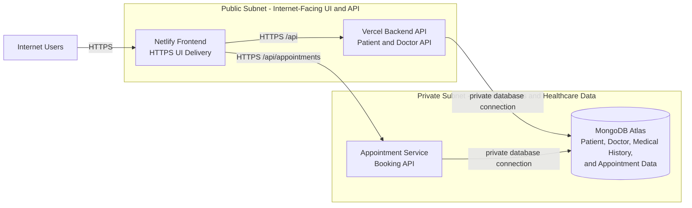

# Hospital Core VPC Blueprint

## Network Boundary

## Access Rules

| Component | Network placement | Allowed access |
|---|---|---|
| Netlify frontend | Public | Internet users over HTTPS only. Serves React UI; no database access. |
| Vercel backend API | Public | Receives patient and doctor API requests over HTTPS. Connects to MongoDB Atlas privately. |
| Appointment service | Private | Receives appointment traffic from frontend through approved HTTPS routes. Connects to MongoDB Atlas privately. |
| MongoDB Atlas | Private | Database access only from backend and appointment-service network identities. No public client access. |

## Data Flow

1. User reaches Netlify over HTTPS.
2. Frontend calls Vercel backend API for patient and doctor requests over HTTPS.
3. Frontend calls appointment service for appointment requests over HTTPS.
4. Private services read and write healthcare data in MongoDB Atlas.
5. MongoDB Atlas never receives browser traffic directly.

## Boundary Summary

Public subnet handles UI and HTTPS API entry points. Private subnet contains service-to-service traffic and sensitive healthcare data. Only approved service connections reach MongoDB Atlas. This keeps patient records and database credentials away from internet-facing frontend clients.
